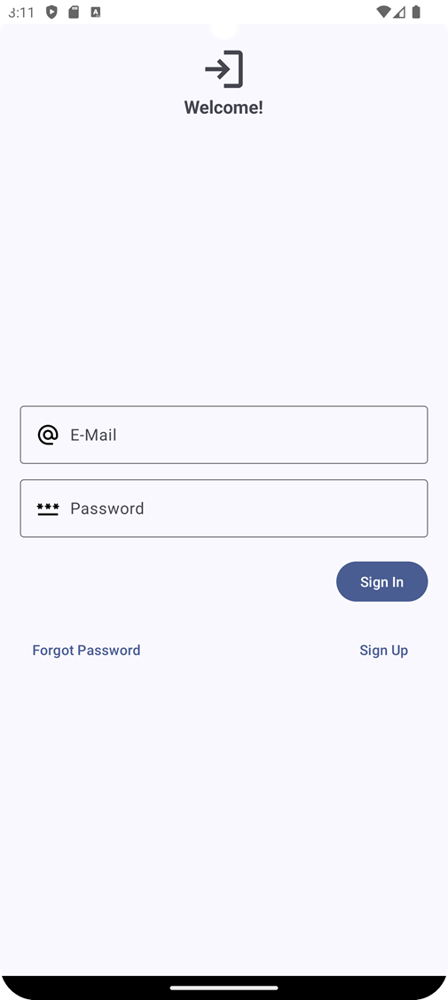
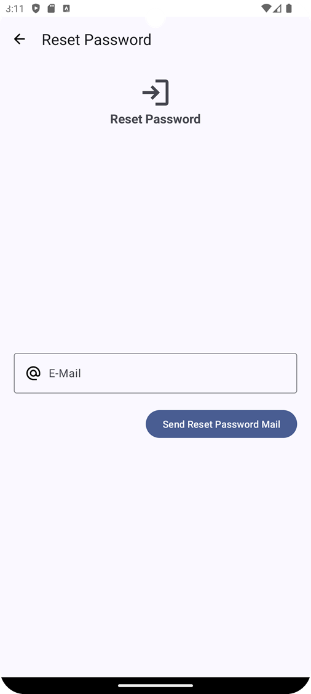
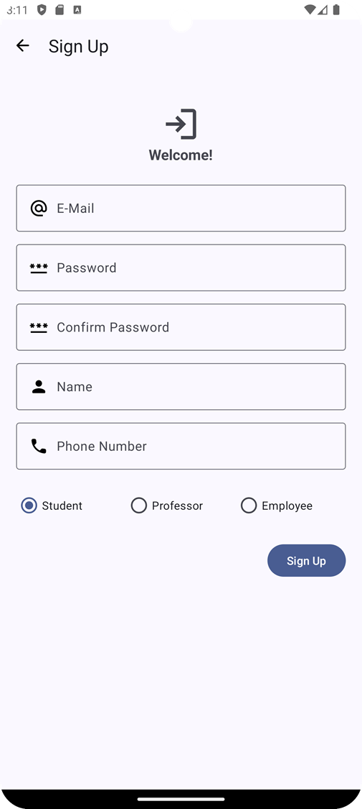
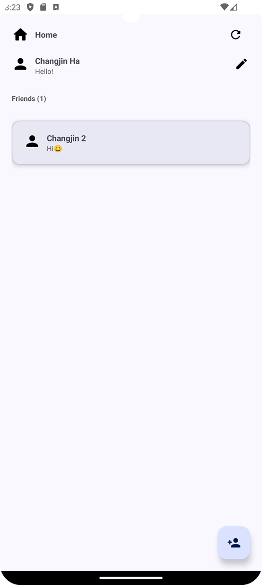
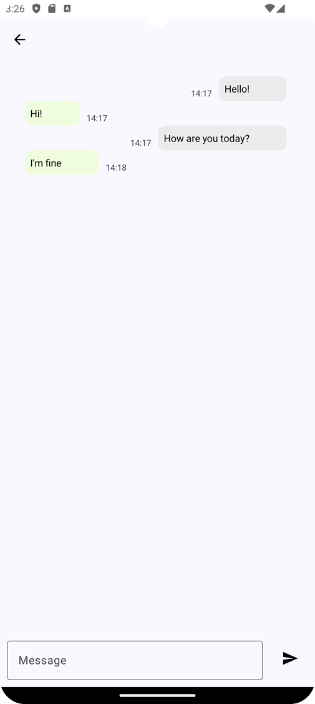

# Messenger

RecyclerView를 이용해 채팅 애플리케이션을 개발하시오.

- 난이도 :  중
- 기한 : 7.12
- 과제 관리 시스템에 결과물 압축 후 업로

요구 조건 - 공통

1. Activity는 Start Activity와 Main Activity로 총 2 개의 Activity를 사용하시오.
2. Entry Point는 Start Activity로 정의되어 있으며, 각 Activity의 child view는 Fragment로 구현하시오.
3. Start Activity가 실행되면 SignInView()를 표시하여 사용자가 로그인할 수 있도록 구현하시오.
4. Main Activity가 실행되면 HomeView()를 표시하시오.

## StartActivity
### SignInView: StartActivity Entry Point

1. 전반적인 요구사항은 이전 과제의 내용과 동일하며, 이전 과제에서 개발한 View를 재사용해도 무방함.
- [x]  사용자가 Sign In 버튼을 탭한 경우 UserManagement 클래스의 signIn() 함수를 호출해 로그인을 진행하시오.
- [x]  signIn()함수의 return 값이 true인 경우 MainActivity를 호출하시오.
- [x]  signIn()함수의 return 값이 false인 경우 Alert를 표시하시오.
- [x]  signIn() 함수는 이전 과제에서 제시한 SignInView의 제한 사항에 모두 해당되지 않는 경우에만 호출하시오.
    1. (예: Field에 아무것도 입력하지 않은 경우 signIn() 함수의 호출 없이 이전 과제와 동일하게 Alert 표시)

### ResetPasswordView

- [x]  사용자가 Send 버튼을 탭한 경우 UserManagement 클래스의 sendPasswordResetMail() 함수를 호출해 비밀번호 재설정 메일을 발송하시오.
- [x]  함수의 return 값이 true, false인 경우 각각에 대해 Alert를 표시하시오.

### SignUpView

- [x]  사용자가 Sign Up 버튼을 탭한 경우 UserManagement 클래스의 signUp() 함수를 호출해 회원가입을 진행하시오.
- [x]  signUp()함수의 return 값이 true인 경우 MainActivity를 호출하시오.
- [x]  signUp()함수의 return 값이 false인 경우 Alert를 표시하시오.
- [x]  signUp() 함수는 이전 과제에서 제시한 SignUpView의 제한 사항에 모두 해당되지 않는 경우만 호출하시오.
    1. 예: Field에 아무것도 입력하지 않은 경우 signUp() 함수의 호출 없이 이전 과제와 동일하게 Alert 표시
## MainActivity
### HomeView: MainActivity Entry Point

- [ ]  RecyclerView를 이용해 친구 목록을 표시하시오.

- [x]  새로고침 버튼을 배치하고,
- [ ]  클릭 시 친구 목록, 사용자 정보를 다시 로드하여 표시하시오.

- [x]  친구 추가 버튼을 배치하고,
- [x]  클릭 시 추가할 친구의 E-Mail 주소를 입력받으시오.

- [x]  프로필 메시지(상태 메시지) 변경 버튼을 배치하고,
- [x]  클릭 시 새로운 프로필 메시지를 입력받으시오.

- [ ]  상태 메시지 변경, 친구 추가 완료 시 친구 목록, 사용자 정보를 다시 로드하여 표시하시오.
- [ ]  RecyclerView에서 친구를 클릭한 경우 ChatDetailView()로 이동하시오.

### ChatDetailView

- [ ]  RecyclerView를 이용해 대화 내용을 표시하시오.
- [x]  하단에 EditText와 전송 버튼을 배치하시오.
- [ ]  전송 버튼을 클릭했을 때 EditText의 내용이 비어있지 않으면 메시지를 전송하시오.
- [ ]  메시지 전송이 완료되면 EditText의 내용을 지우시오.